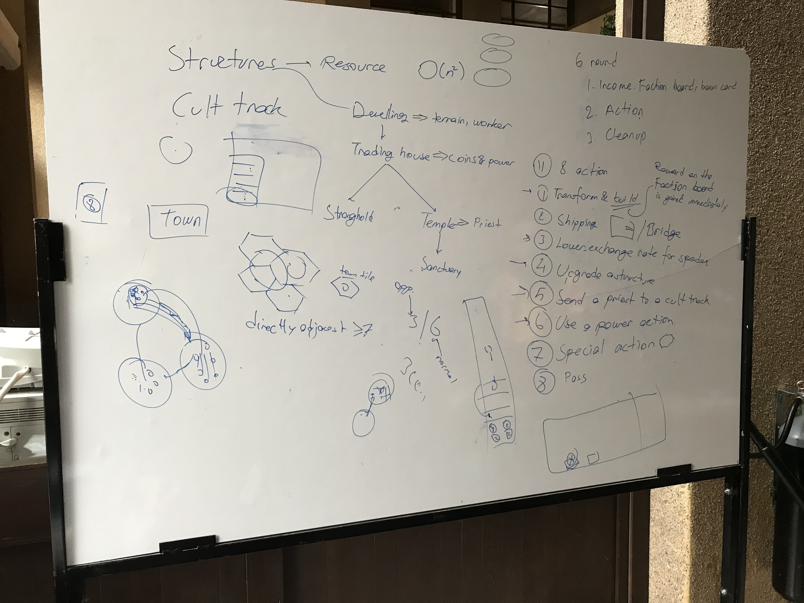
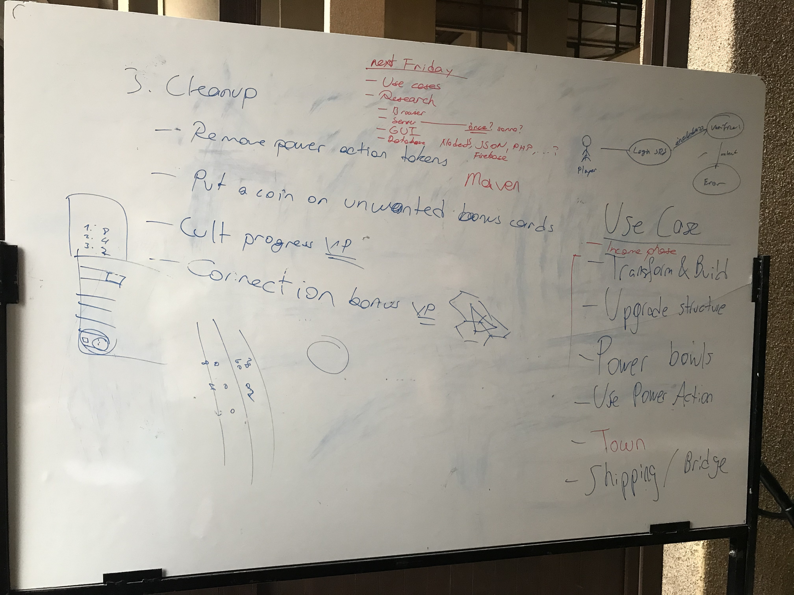

# **Group Meeting: 21 February 2020** :calendar:

**Participants:** Zeynep, Kamil, Arda, Efe, Rafi
**Place:** EB Building
**Time:** 13.30-15.30, Friday

## **Action Items** :white_check_mark:

- Game Rules drawn on board, general discussion about possible design choices that we can take during the development of the game.

- Discussion About Possible Features: 
    - Randomized Map
    - We won't be adding features that won't harness the power of digitalization. 

- If we have time we will make the game online.

- Server will developed in parallel with the game.

## **Agenda** :bookmark:
- Analysis Report will discussed.
- Workload for the report will divided between group members. 
- We will draw Use Case Diagrams, Class Diagrams and Sequence Diagrams.

## **Images**

