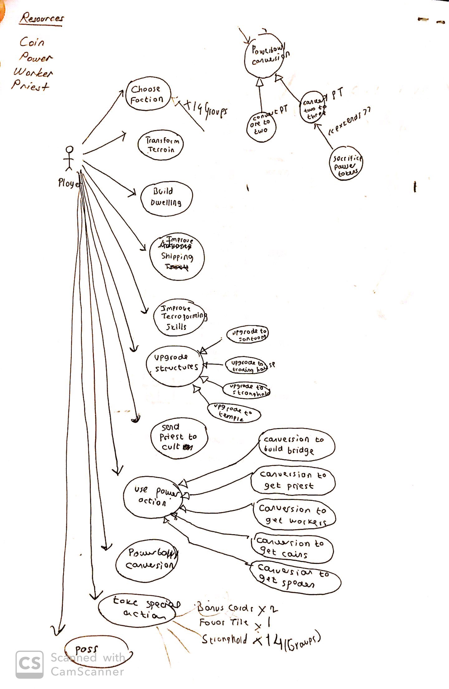

# **Group Meeting: 28 February 2020** :calendar:

## **Things Done** :white_check_mark:

- Use Case Diagram Discussed
- The analysis report divided between team members.

## **To Next Meeting** :bookmark:

- Finished Analysis Report
- Start breaking down and start the project's coding part.

### To do:

- [X] Use Case Diagram
- [ ] Class Diagram
- [ ] Sequence Diagram

## **Images**

 