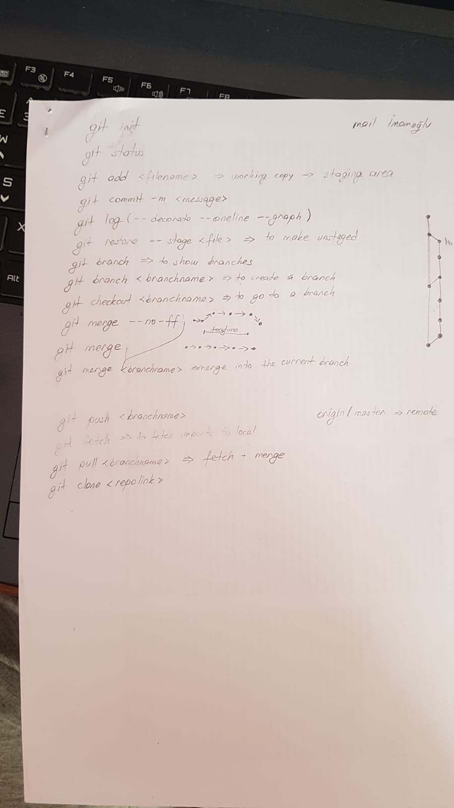

# **Group Meeting: 30 March 2020** :calendar:

- **Participants:** Zeynep, Kamil, Arda, Efe, Rafi
- **Place:** Zoom Meeting
- **Time:** 13.30-15.30, Sunday

## **Action Items** :white_check_mark:

- [X] General discussion about how we will approach to the project. 
- [X] Git tutorial image attached.  

## **Agenda** :bookmark:

- [ ] Kamil: Java Class Diagrams (Build & Transform Terrain) 
- [ ] Arda: Java Class Diagrams (Build & Transform Terrain) 
- [ ] Zeynep: UI  (Build & Transform Terrain) 
- [ ] Rafi: UI  (Build & Transform Terrain) 
- [ ] Efe: Setting up the Server -> Thinking of using Google Firebase Database

## **Images**

